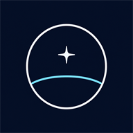

# 方界深空 · VOXEL HORIZON

浏览器端的体素行星探索与生存游戏。玩家采集资源、制作组件、修复飞船并跃迁至新的程序化星球。游戏界面为简体中文；地形、纹理、音频和命名优先由种子在运行时生成。

<p align="center">
  
</p>

## 功能概览

- Three.js r185 WebGPU 渲染；不支持 WebGPU 时由运行时降级到 WebGL2。
- GPU 驱动网格生成仍在实验阶段；默认使用经过验证的 CPU 网格，可在配置中开启以测试原生 WebGPU 的计算着色器与间接绘制路径。
- Vue 3 + Pinia 游戏界面，Three.js 引擎在开始游戏时懒加载。
- 十个 OPFS 本地存档槽、自动存档和设置持久化。
- 首次进入需设定本地昵称；昵称用于本设备的官方云档案身份。
- 键鼠与触摸控制、PWA 安装与离线壳。
- 联机大厅：玩家主机房间，以及由 Durable Object 托管、R2 归档世界与匿名玩家进度的官方公共星域。

## 快速开始

需要 Node.js `^20.19.0` 或 `>=22.12.0`（Vite 8 的要求）和 npm。

```bash
git clone https://github.com/lemonhub-io/voxel-horizon-demo.git
cd voxel-horizon-demo
npm install
npm run dev
```

开发服务器默认打开浏览器。生产构建与预览：

```bash
npm run build
npm run preview
```

## 常用命令

```bash
npm run typecheck       # TypeScript 检查
npm run lint            # 检查 src/ 下的代码
npm run format:check    # 检查 src/ 格式
npm run test            # 一次性运行 Vitest
npm run test:coverage   # 生成 V8 覆盖率报告
npm run mp:dev          # 在 :8787 启动联机 Worker
npm run cdn:dev         # 在 :8790 启动 R2 CDN Worker
```

运行 `npm run mp:dev` 后，Vite 会把 `/mp` 的 HTTP 与 WebSocket 请求代理至本机 `:8787`。生产环境可通过 `VITE_MP_HTTP_URL` 和 `VITE_MP_WS_URL` 覆盖联机 API 与 WebSocket 地址。

## 项目结构

```text
src/                    前端：游戏引擎、Vue 界面、Pinia、联机客户端和测试
public/                 PWA 清单、Service Worker、应用图标、可选 CC0 模型
workers/mp-server/      Cloudflare 联机 Worker 与 Durable Objects
workers/r2-cdn-proxy/   跨账户 R2 只读 CDN Worker
docs/                   架构、测试和部署说明
```

## 文档

- [贡献指南](CONTRIBUTING.md)
- [架构说明](docs/architecture.md)
- [测试指南](docs/testing.md)
- [部署指南](docs/deployment.md)
- [联机 Worker API 与部署](workers/mp-server/README.md)
- [R2 CDN Worker](workers/r2-cdn-proxy/README.md)
- [CC0 模型清单与许可](public/models/cc0/ASSETS.md)
- [变更日志](CHANGELOG.md)

## 许可证

[MIT](LICENSE)。
